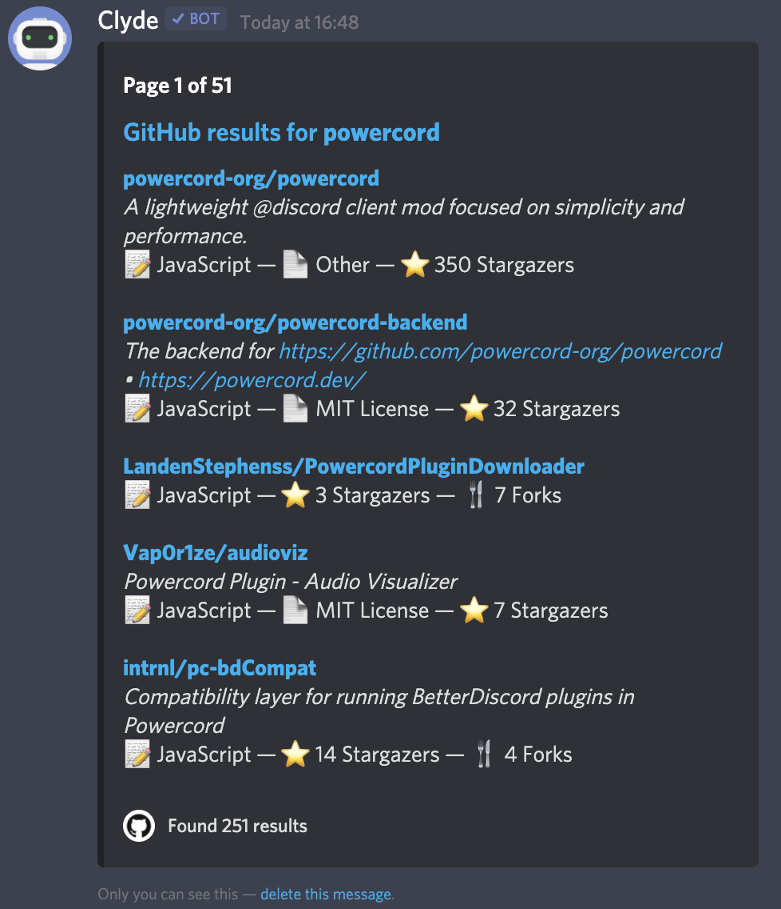
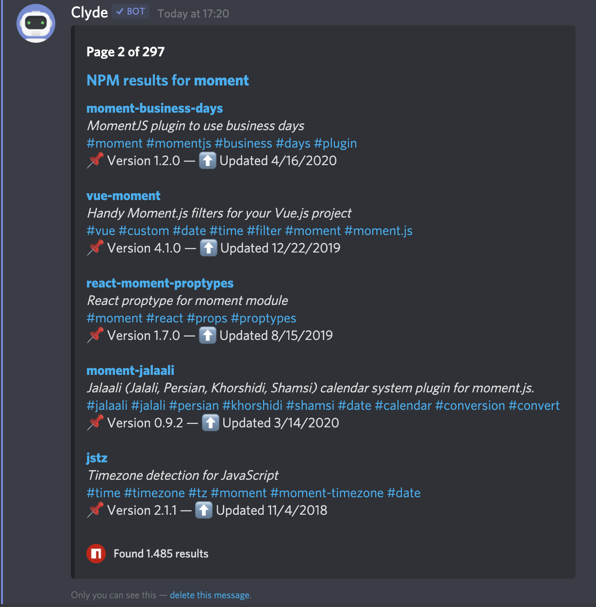

# DevCommands

Powercord plugin that adds multiple commands for querying common sites used during development

## Commands
`.github [--page <page num>] <search query>` for searching GitHub repositories
`.npm [--page <page num>] <search query>` for querying the npm registry.

## Preview

## Sending results
Use my [SendToChannel](https://github.com/tobimori/powercord-sendtochannel/) plugin.